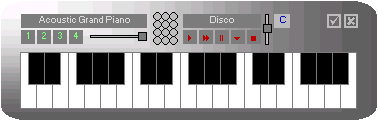



## MyPiano

### Description

A simple piano application using windows Midi API. Include 3 octave notes, 4 instruments bank, 3 rhythm beats, 12 percussion keys. Great code to download!
 
### More Info
 

             |
---                |---
**Submitted On**   |2003-02-13 08:48:54
**By**             |[antonukdw](https://github.com/Planet-Source-Code/PSCIndex/blob/master/ByAuthor/antonukdw.md)
**Level**          |Intermediate
**User Rating**    |4.9 (84 globes from 17 users)
**Compatibility**  |VB 4\.0 \(32\-bit\), VB 5\.0, VB 6\.0
**Category**       |[Sound/MP3](https://github.com/Planet-Source-Code/PSCIndex/blob/master/ByCategory/sound-mp3__1-45.md)
**World**          |[Visual Basic](https://github.com/Planet-Source-Code/PSCIndex/blob/master/ByWorld/visual-basic.md)
**Archive File**   |[MyPiano1543122122003\.zip](https://github.com/Planet-Source-Code/antonukdw-mypiano__1-43153/archive/master.zip)

